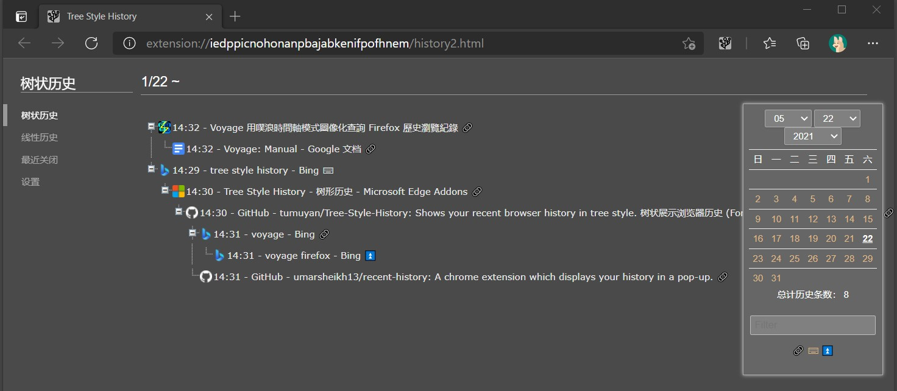

# Tree Style Histyle

This extension shows your recent browser history in tree style.  
When you browser pages from internet, you always jump from one page to another by clicking hyper-text links. This extension shows such a jumping relationship through a tree structure, help you find out what you were doing, what website you visited, and whether something has been done.  

Also following features are available.  
1. Use the right-click menu to quickly search the history for current site, or the site linked to.
2. Tree view of recently closed pages. They are group by when they were closed and whether they were closed properly. 
3. Linear view of bookmarks. Usually browser shows bookmarks in tree style, this extension does the opposite, reorders and displays bookmarks by time and site.  

This work is based on [Recent History](https://github.com/umarsheikh13/recent-history) and has get the permission to modify and publish the code as a new exttension, many thanks to Umar.  
Currently only Chinese and English UI are available.  

树状展示浏览器历史。
在使用浏览器访问网页时，用户往往会通过点击链接，从一个页面跳转到另一个页面。本扩展通过树状结构展示了这样的跳转关系，从而让用户能够更快地弄清楚自己当时在做什么，访问了什么网站，当时要做的事情是否已经完成。 
除此核心功能外，还有如下特色：  
1. 使用右键菜单，快速搜索当前网站，或者链接指向的网站的访问历史。
2. 树状查看最近关闭的页面。根据关闭页面的时间、是否正常关闭对页面自动分组。批量打开一个分组的全部页面。
3. 线性查看书签。通常浏览器使用树状结构展示书签；本扩展反其道而行，按照时间和网站重新排序并展示书签，方便查看和整理最新收藏的内容。

灵感来自Firefox扩展[voyage](https://docs.google.com/document/d/1oaJjS9zWGQDBzy4wE403P7V2nQukMql_sfvAURl2noI/preview)，后来ff飙版本的时候这个扩展就废了，现在连发布页都被删除。  
我一直没有再见到类似的扩展，所以自己就搓了一个，算是完成多年夙愿。  
基于Umar的扩展[Recent History](https://github.com/umarsheikh13/recent-history)修改，已经获得原作者Umar的许可可以修改并且作为一个新的扩展进行发布，非常感谢他的劳动和许可。 

## Policy  

Tree Style History collects your browser history, analyzes it and stores it on your computer, and shows it when needed.   
It does not upload data to the Internet or share it with other programs. When you uninstall the extension, all saved data will be automatically erased by the browser.  

Tree Style History会收集您的浏览器记录，分析并存储到您的计算机内，并在需要的时候进行展示。  
它不会上传数据上传到互联网或者分享给其他程序。当您卸载扩展时，所有保存的数据均会被浏览器自动清除。  

## Install  
I have uploaded it to Edge Add-ons
https://microsoftedge.microsoft.com/addons/detail/gfmkhnaldbgcpoddmapciblllofekbpn  

I don't have Chrome Web Store developer account, but @oXnMe uploaded it to Chrome Web Store
https://chrome.google.com/webstore/detail/tree-style-history/khcenbpnhbeplojhaolbpldmoppicold  

Or download - unzip - load the folder in developer mode.  
https://github.com/tumuyan/Tree-Style-History/issues/1  

已经上传到Edge外接程序商店
https://microsoftedge.microsoft.com/addons/detail/gfmkhnaldbgcpoddmapciblllofekbpn  

我没有Chrome商店的开发者帐号,但是有网友代上传了Chrome商店.
https://chrome.google.com/webstore/detail/tree-style-history/khcenbpnhbeplojhaolbpldmoppicold  

或者打开浏览器的开发者模式，[下载压缩包](https://github.com/tumuyan/Tree-Style-History/archive/refs/heads/main.zip)解压并载入  
https://jingyan.baidu.com/article/ca2d939dfa5762ab6d31ce10.html  
https://github.com/tumuyan/Tree-Style-History/issues/1  

## Changlog

3.1.11 (2022/06/11) 修改选项：自定义点击图标后的动作；调整右键菜单的文本，增加是否显示右键菜单的开关(#15)  

3.1.10 (2022/06/10) 增加功能：在树状历史中点击链接时，如果已经有此网址对应的标签页，则跳转到已经打开的页面，而不新打开页面（另外在测试时发现浏览器要求升级manifest_version，试了试不太能轻松搞定，希望有朋友来帮忙完成更新！）  

3.1.9 (2022/1/27) 完善线性历史、线性书签的外观：为按钮增加提示文字，优化时间显示，去除线性书签的无效checkbox和无效提示内容，显示线性书签的域名分类下包含的书签数量  

3.1.8 (2021/8/9) 增加选项：在“弹窗设置”中增加“显示弹窗”选项，选择是（弹窗）否（打开树状历史）  

3.1.7 (2021/6/24) 修复bug：在“最近关闭”的页面点击链接，会自动打开2个页面

3.1.6 (2021/6/7) 修复bug：Chrome无法显示默认历史管理器的问题（在Edge是正常的）；线性书签无法正常显示小书签（bookmarklet）

3.1.5 (2021/5/29)  
增加功能：线性书签标签页。  
增加选项：指定在popup弹窗中点击“更多”时，打开浏览器默认的页面还是扩展内置页面。  
修复bug：设置-下载参数时弹窗顺序显示有错误；日期没有自动补零。  
已知问题：浏览器限制同一个扩展最多绑定4个快捷键，现在通过特别的方式绑定了5个快捷键，导致扩展默认快捷键无法生效，需要手动设置。

3.1.4 (2021/5/22) - 增加功能：树状历史中显示较少的历史（默认关闭，需要在设置中手动打开），批量打开最近关闭的页面。优化：微调外观，一定程度上实现了窄窗口自适应(但是使用Android kiwi浏览器测试确认手机不能实现主要功能)，统一变更过滤域名的算法  

3.1.3 (2021/5/18) - 增加功能：树状展示最近关闭的页面；修复：令日期和时间选项对树状历史同样生效；优化：微调外观，修改设置中的默认参数。 

3.1.2 (2021/5/11) - 优化搜索浏览记录功能，增加选项同步功能（跟随浏览器账户自动同步），增加快捷键设置（可以通过设置快捷键替换默认历史记录管理器），缓存访问历史的网址数量，优化部分UI的样式和命名，增加清除缓存功能，优化网址过滤功能。

3.1.1 (2021/04/26) - 为树状历史页增加访问类型筛选功能，为树状历史增加loading动画/加大行间距，增加对网址标题特殊符号的处理，历史数量较少时自动载入前日记录，调整默认的设置参数，调整Chrome设置默认历史页面的选项（Edge屏蔽此功能），增加设置页的提示文字，优化历史缓存记录，降低搜索字数限制，增加暗黑模式（根据浏览器设置自动切换），调整popup页面外观，增加右键菜单“搜索此网站的浏览记录”。

3.1.0 (2021/04/18) - Add the basic tree style function.

## License  

Tree Style History, Tree Style History (Toolbar Icon)

Copyright (c) 2021 Tumuyan <tumuyan@gmail.com>
  
This Work is based on Recent History and has get the 
permission to modify and publish the code as a new exttension.
  
----

Recent History, Recent History (Toolbar Icon)

Copyright (c) 2011-2020 Umar Sheikh <hello@umarsheikh.co.uk>

THE EXTENSION IS PROVIDED IN THE HOPE THAT IT WILL BE USEFUL,
BUT WITHOUT ANY WARRANTY. IT IS PROVIDED "AS IS" WITHOUT
WARRANTY OF ANY KIND, EITHER EXPRESSED OR IMPLIED, INCLUDING,
BUT NOT LIMITED TO, THE IMPLIED WARRANTIES OF MERCHANTABILITY
AND FITNESS FOR A PARTICULAR PURPOSE.

IN NO EVENT UNLESS REQUIRED BY APPLICABLE LAW THE AUTHOR WILL
BE LIABLE TO YOU FOR DAMAGES, INCLUDING ANY GENERAL, SPECIAL,
INCIDENTAL OR CONSEQUENTIAL DAMAGES ARISING OUT OF THE USE OR
INABILITY TO USE THE PROGRAM (INCLUDING BUT NOT LIMITED TO LOSS
OF DATA OR DATA BEING RENDERED INACCURATE OR LOSSES SUSTAINED
BY YOU OR THIRD PARTIES OR A FAILURE OF THE PROGRAM TO OPERATE
WITH ANY OTHER PROGRAMS), EVEN IF THE AUTHOR HAS BEEN ADVISED
OF THE POSSIBILITY OF SUCH DAMAGES.

Attribution-Noncommercial-No Derivative Works 3.0 Unported
http://creativecommons.org/licenses/by-nc-nd/3.0/
