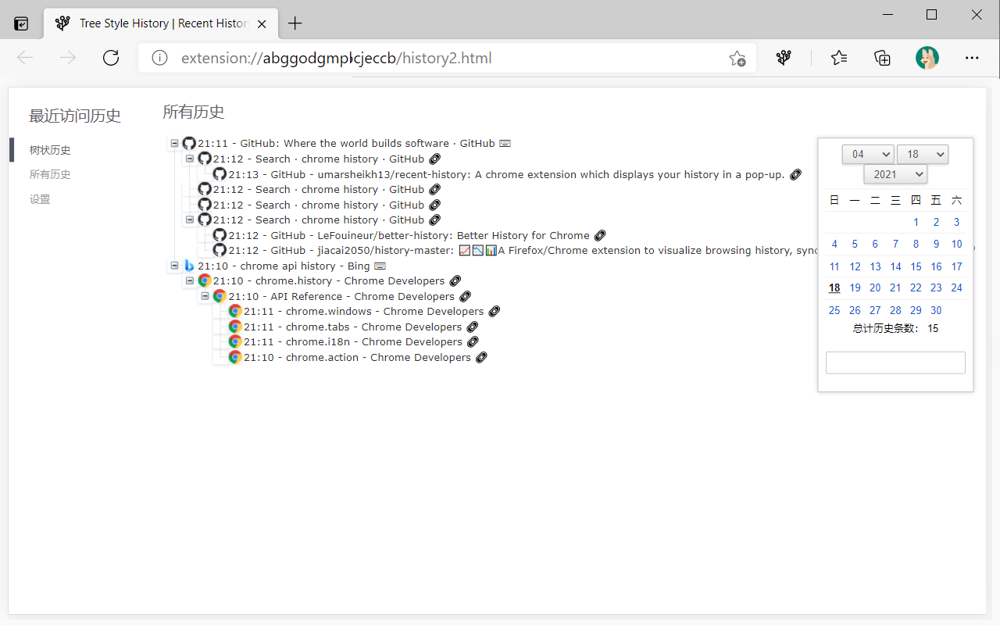

# Tree Style Histyle

This extension shows your recent browser history in tree style.  
This work is based on [Recent History](https://github.com/umarsheikh13/recent-history) and has get the permission to modify and publish the code as a new exttension, many thanks to Umar.  
Currently only Chinese and English UI are available.  

树状展示浏览器历史。  
灵感来自多年以前的Firefox扩展voyage，后来ff飙版本的时候这个扩展就废了，现在连发布页都被删除了。  
我一直没有再见到类似的扩展，所以自己就搓了一个。  
基于Umar的扩展[Recent History](https://github.com/umarsheikh13/recent-history)修改，已经获得原作者Umar的许可可以修改并且作为一个新的扩展进行发布，非常感谢他的劳动和许可。  

## Policy  

Tree Style History collects your browser history, analyzes it and stores it on your computer, and shows it when needed.   
It does not upload data to the Internet or share it with other programs. When you uninstall the extension, all saved data will be automatically erased by the browser.  

Tree Style History会收集您的浏览器记录，分析并存储到您的计算机内，并在需要的时候进行展示。  
它不会上传数据上传到互联网或者分享给其他程序。当您卸载扩展时，所有保存的数据均会被浏览器自动清除。  

## Install  
I have uploaded it to Edge Add-ons
https://microsoftedge.microsoft.com/addons/detail/gfmkhnaldbgcpoddmapciblllofekbpn  

I don't have Chrome Web Store developer account, but @oXnMe uploaded it to Chrome Web Store
https://chrome.google.com/webstore/detail/tree-style-history/khcenbpnhbeplojhaolbpldmoppicold  

Or download - unzip - load the folder in developer mode.  
https://github.com/tumuyan/Tree-Style-History/issues/1  

已经上传到Edge外接程序商店
https://microsoftedge.microsoft.com/addons/detail/gfmkhnaldbgcpoddmapciblllofekbpn  

我没有Chrome商店的开发者帐号,但是有网友代上传了Chrome商店.
https://chrome.google.com/webstore/detail/tree-style-history/khcenbpnhbeplojhaolbpldmoppicold  

或者打开浏览器的开发者模式，[下载压缩包](https://github.com/tumuyan/Tree-Style-History/archive/refs/heads/main.zip)解压并载入  
https://jingyan.baidu.com/article/ca2d939dfa5762ab6d31ce10.html  
https://github.com/tumuyan/Tree-Style-History/issues/1  

## Changlog

3.1.2 (2021/5/09) - 优化搜索浏览记录功能，增加右键菜单（添加域名到过滤列表），增加选项同步功能（跟随浏览器账户自动同步），增加快捷键功能，缓存访问历史的网址数量

3.1.1 (2021/04/26) - 为树状历史页增加访问类型筛选功能，为树状历史增加loading动画/加大行间距，增加对网址标题特殊符号的处理，历史数量较少时自动载入前日记录，调整默认的设置参数，调整Chrome设置默认历史页面的选项（Edge屏蔽此功能），增加设置页的提示文字，优化历史缓存记录，降低搜索字数限制，增加暗黑模式（根据浏览器设置自动切换），调整popup页面外观，增加右键菜单“搜索此网站的浏览记录”。

3.1.0 (2021/04/18) - Add the basic tree style function.

## License  

Tree Style History, Tree Style History (Toolbar Icon)

Copyright (c) 2021 Tumuyan <tumuyan@gmail.com>
  
This Work is based on Recent History and has get the 
permission to modify and publish the code as a new exttension.
  
----

Recent History, Recent History (Toolbar Icon)

Copyright (c) 2011-2020 Umar Sheikh <hello@umarsheikh.co.uk>

THE EXTENSION IS PROVIDED IN THE HOPE THAT IT WILL BE USEFUL,
BUT WITHOUT ANY WARRANTY. IT IS PROVIDED "AS IS" WITHOUT
WARRANTY OF ANY KIND, EITHER EXPRESSED OR IMPLIED, INCLUDING,
BUT NOT LIMITED TO, THE IMPLIED WARRANTIES OF MERCHANTABILITY
AND FITNESS FOR A PARTICULAR PURPOSE.

IN NO EVENT UNLESS REQUIRED BY APPLICABLE LAW THE AUTHOR WILL
BE LIABLE TO YOU FOR DAMAGES, INCLUDING ANY GENERAL, SPECIAL,
INCIDENTAL OR CONSEQUENTIAL DAMAGES ARISING OUT OF THE USE OR
INABILITY TO USE THE PROGRAM (INCLUDING BUT NOT LIMITED TO LOSS
OF DATA OR DATA BEING RENDERED INACCURATE OR LOSSES SUSTAINED
BY YOU OR THIRD PARTIES OR A FAILURE OF THE PROGRAM TO OPERATE
WITH ANY OTHER PROGRAMS), EVEN IF THE AUTHOR HAS BEEN ADVISED
OF THE POSSIBILITY OF SUCH DAMAGES.

Attribution-Noncommercial-No Derivative Works 3.0 Unported
http://creativecommons.org/licenses/by-nc-nd/3.0/
